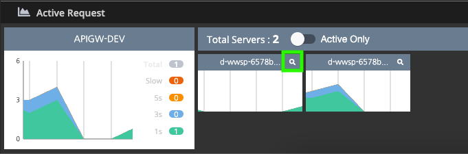
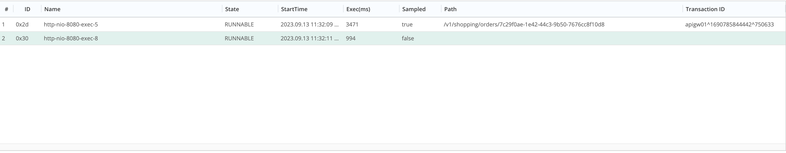
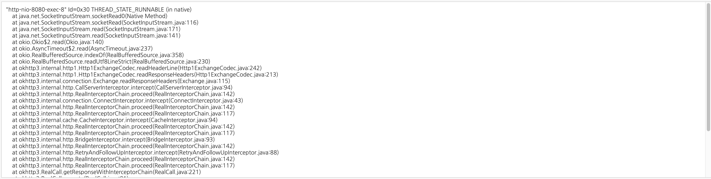
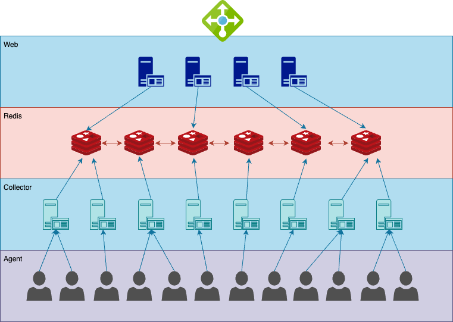
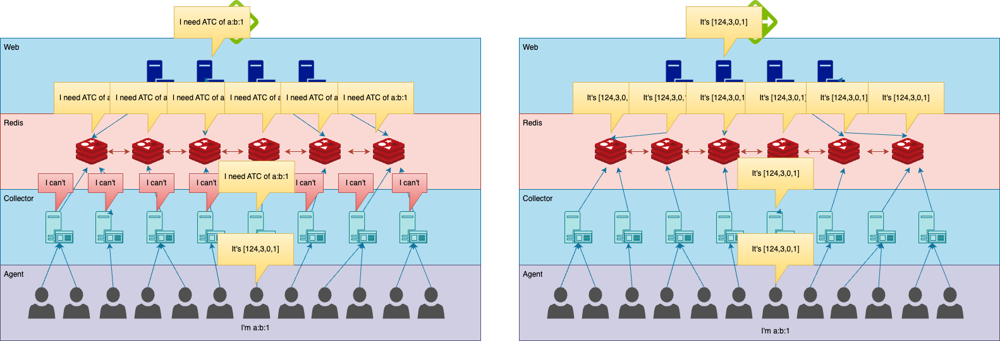

# Real-time active request monitoring

The collection of request information can sometimes be so resource intensive that it can have a serious impact on the target system. Pinpoint provides a number of features that allow this expensive information to be monitored in real time only when the user really needs it.

## Features

The realtime monitor consists of 2 features: recording the number of active requests, thread-dumping the thread handling the active request

### Active request - realtime graph

In the datetime range picker there is a `REAL TIME` button which is focused on automatically augmenting the current data with the just generated realtime data.


REAL TIME also activates the Active Requests window. This shows the number of active requests at the moment.



### Active request thread dump

Pressing the icon in the green square above navigates to the thread dump view



The above list view contains brief information about the threads that were handling requests at the time the page was loaded. When the item is selected, the thread dump is collected and displayed in the UI as shown below.



The thread dump only works if the request is still active, but can be replaced with `There is no message( may be completed)` if the request session is already closed by the time the user selects the item in the list.

## Requirements and installation

These features are **disabled by default** and can be enabled with the property `pinpoint.modules.realtime=true`.

### Required properties

Once the feature is enabled, the [Redis](https://redis.io) connection must be provided, which can be configured by adjusting the properties below in `redis/src/main/resources/redis/profiles'.

Most of the properties below follow, but are not exactly the same as, those defined in the [spring-data-redis](https://spring.io/projects/spring-data-redis) library.

```yaml
spring.data.redis.lettuce.client.io-thread-pool-size=8
spring.data.redis.lettuce.client.computation-thread-pool-size=8
spring.data.redis.lettuce.client.request-queue-size=1024

spring.data.redis.username=default
spring.data.redis.password=

# Standalone mode
spring.data.redis.host=localhost
spring.data.redis.port=6379

# Cluster mode: Cluster mode is prior to standalone
spring.data.redis.cluster.nodes=localhost.1:6379,localhost.2:6379,localhost.3:6379
```

If `spring.data.redis.cluster.nodes` is not empty, `spring.data.redis.host` is ignored.

## Architecture

Real-time information is not collected on a 24-hour basis, but is triggered by some kind of signal from a collector listening to a specific channel for broadcasting the event that a user has accessed that web page (demand). The collected information (supply) is immediately sent to the corresponding channel in Redis and can be read by the web server that sent the demand event.



### Case: the number of active requests

Most of the specifications for this section are described in `ATCServiceProtocolConfig.java`.

```java
@Bean
FluxChannelServiceProtocol<ATCDemand, ATCSupply> atcProtocol(ObjectMapper objectMapper) {
    return ChannelServiceProtocol.<ATCDemand, ATCSupply>builder()
      ...
            .setDemandPubChannelURIProvider(demand -> URI.create(RedisPubSubConstants.SCHEME + ":demand:atc-2"))
            .setDemandSubChannelURI(URI.create(RedisPubSubConstants.SCHEME + ":demand:atc-2"))
            .setSupplyChannelURIProvider(demand -> URI.create(RedisPubSubConstants.SCHEME + ":supply:atc-2:" + demand.getApplicationName() + ':' + demand.getAgentId() + ':' + demand.getStartTimestamp()))
            .buildFlux();
}
```

As described in the code above, the demand for the number of active requests is communicated over the redis pubsub channel using the key `demand:atc-2`. If real-time is enabled, all collectors should listen to this channel from the start.

A collector can ignore a demand event if it determines that it cannot respond to that event on its own, but you should design your demands carefully so that there is exactly one collector that can respond to the demand.

The appropriate collector with the appropriate connection triggers the agent to gather the required information, which is then passed in real time to the redis pubsub supply channel with the key 'supply:atc-2:{applicationName}:{agentId}:{startTimestamp}'.


